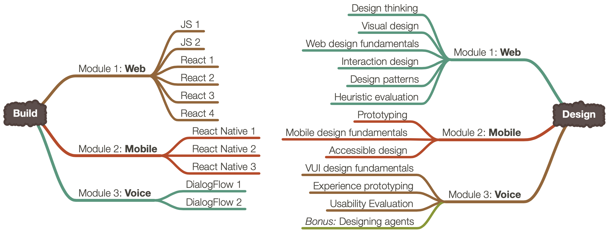

# Welcome to CS-571 Building User Interfaces

## What is this class about?
This class aims to introduce CS undergraduates to the wonderful world of **User Experience (UX) development**.

But what is UX development? Sometimes called front-end development, UX development is between traditional software development and UX design. Let's hear about it from an  <a target="_blank" href="https://uxmag.com/articles/hi-im-a-ux-developer-youre-a-what"><strong>actual UX developer</strong></a>:

> The realm of the UX developer exists somewhere between that of the traditional developer and the designer. We’re not really designers, yet to be a good UX developer you certainly need to have an eye for design. In the same vein, we’re not traditional developers but we certainly need to have development experience and expertise. Often this experience spans multiple technologies, languages, and platforms.

> It falls on the UX developer to bridge the gap between design and technology. We need to be able to think and speak the language of designers. It’s our job to help translate their vision to the development team in a way that they can understand and accept. This can be a critical piece of the puzzle in a project, especially if the design and the interactions behind it are complex.

> Similarly, we need to speak on behalf the developers to help reign in the designers, at times. If they are coming up with concepts that will be extremely difficult or time consuming to implement, we can explain the limitations of the technology and the complexity involved in implementing their designs, and try to come up with an acceptable alternative.

> — Tim R. Todish

With UX development skills, you can become better software developers with an eye for design and the ability to speak the language that UX designers speak. Alternatively, you can become a UX designer by strengthening your design skills, for example, by taking CS-570.

## What will I learn in this class?
As an introduction to UX development, the course will cover the (1) programming skills you will need to prototype and build user-facing applications and (2) design skills you will need to understand user needs, devise solutions, and test how well they work. The design skills, under the category **design**, are introduced on Tuesdays, and the programming skills, under the category **build**, are introduced on Thursdays. Across three modules, you will focus on **web**, **mobile**, and **voice** interfaces. For each module, we will use the programming framework that is most commonly used in the software development industry. Below is a visual breakdown of the topics.

## Who should be taking this class?
Anyone pursuing a CS major or certificate who has taken CS-400 or an equivalent class.

## What do I need to know/have?
Intermediate knowledge of Java, basic knowledge of HTML and CSS, and tools that are outlined in the [technology requirements page](technology.html).

## Ok, great. What's next?

The majority of the course content can be found on this website, and links below provide additional resources for lectures, assignments, and course communication.

### Course Access

The course can be taken in two formats: (1) in class; and (2) online, asynchronously (through recorded lectures). 

<!-- <table>
<tr>
	<td>
		<a class="label" href="">Course time & location</a>
	</td>
	<td>
		TR 11:00-12:15 pm
	</td>
	<td>
    <a target="_blank" class="btn btn-green" href="http://go.wisc.edu/n6986j">Live stream</a>
	</td>
</tr>
</table> -->
### Course Communication

Students can use the following systems to review and submit assignments, ask questions, and communicate with the instructional team.

 <table>
<tr>
	<td>
		<a class="btn" href="https://canvas.wisc.edu/courses/273395">Course Canvas</a>
	</td>
	<td>
		<a class="btn" href="https://piazza.com/wisc/fall2021/cs571">Course Piazza Page</a>
	</td>
	<td>
		<a class="btn" target="_blank" href="https://teams.microsoft.com/l/team/19%3alPXH5jeZKL7HaSjjo3QDECKCsh7nFv5EUfqqp7sAPA01%40thread.tacv2/conversations?groupId=eb582d1e-43a6-4b82-a17b-7234cfc8ca76&tenantId=2ca68321-0eda-4908-88b2-424a8cb4b0f9">Course Microsoft Teams</a>
	</td>
  <td>
		<a class="btn" target="_blank" href="https://classroom.github.com/classrooms/83735513-hci-uwmadison-cs571-f21">GitHub Classroom</a>
	</td>
</tr>
</table> 

