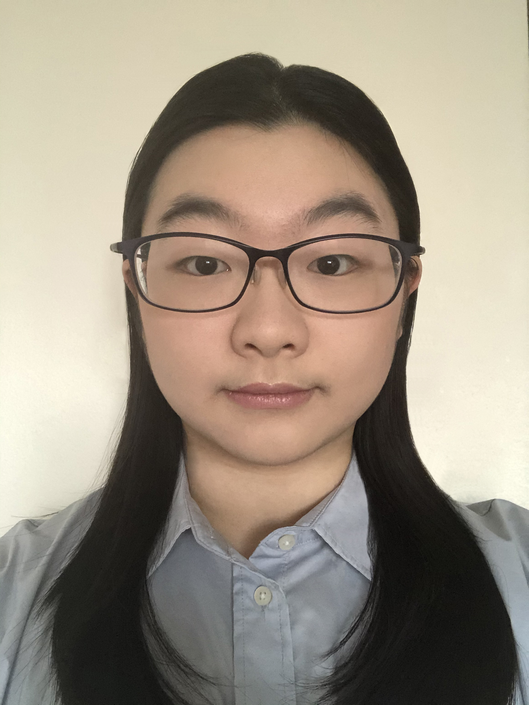

## INSTRUCTORS AND TEACHING ASSISTANTS  
### INSTRUCTOR TITLE AND NAME  
Assistant Professor Yuhanng Zhao  
Department of Computer Sciences, University of Wisconsin–Madison  
1210 W Dayton St, Madison, WI 53706-1685 USA  
**E-mail:** yuhang.zhao@cs.wisc.edu  

#### INSTRUCTOR AVAILABILITY  
During scheduled office hours (Thursday 4:30-5:30 pm) or by appointment.

#### INSTRUCTOR EMAIL/PREFERRED CONTACT  
Preferred instructor contact is via email. 

### TEACHING ASSISTANTS  
Brandon Cegelski  
Salman Munaf  
Sujitha Perumal  

#### TA OFFICE HOURS  
See the table for instructional team office hours. All office hours will be held via Microsoft Teams.

#### TA EMAIL/PREFERRED CONTACT  
Please either mention or start a new chat with the peer mentors in Microsoft Teams.

### PEER MENTORS  
Ilkyu Ju  
Yuren Sun  

#### PEER MENTOR OFFICE HOURS  
See the table for instructional team office hours. All office hours will be held via Microsoft Teams.

#### PEER MENTOR EMAIL/PREFERRED CONTACT  
Please either mention or start a new chat with the peer mentors in Microsoft Teams.
